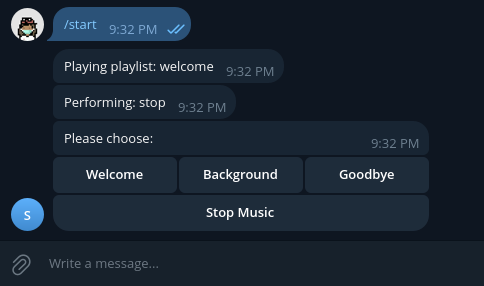

# Introduction

I wanted to be able to play music remotely on my server wherever i am.
This tool can be used in various ways:

1. Play background music before the guest arrives
1. Greet a guest when they arrive
1. Say thank you when a parcel is delivered
1. and more 

On the backend, i'm using telegram bot, and i have set it such that the token and private chat_id is limited to only me, so that other users will not be able to message the bot and get it to perform any tasks.

## Setup

0. Pre-requisite: I'm assuming you already know how to set up a telegram bot, if not, [head here for more information](https://core.telegram.org/bots/tutorial#introduction)

1. Create the environment
```bash
python3 -m venv env
source env/bin/activate
pip install -r requirements.txt
```

2. Update the `shebang` in the player.py file to the python version in your virtual environment.

3. Create a `.env` file in the same directory with the following content:
```
TOKEN = '<TOKEN>'
CHAT_ID = <CHAT_ID>
```

4. Update the TOKEN and CHAT_ID in the `.env` config file.

5. Ensure that the playlist path is correct in `player.py` line 22-27.


## Deployment and testing

1. Ensure that the `player.py` is executable. 
`$ chmod +x player.py`

2. Launch the application.
`$ ./player.py`

3. Message the bot on telegram. It should display something like the below:


4. If the CHAT_ID was not configured properly, you would receive:
`Sorry, I'm unable to respond to you. Please contact the author.`
